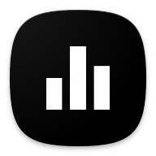

<h1> Equalizer314</h1>

## Known Issues

### Conflicts with other audio effect apps

Equalizer314 uses Android's DynamicsProcessing API on audio session 0 for system-wide audio processing. Only one app can control session 0 at a time. If another equalizer or audio effect app is installed (such as Precise Volume, Wavelet, Sound Assistant, or any other EQ app), they will fight over session 0 and cause audio glitches or the EQ to turn off unexpectedly.

**If you experience the EQ turning off on its own, uninstall or disable other audio effect apps and reboot your device.**

Equalizer314 includes an auto-reclaim feature that will attempt to reclaim session 0 if another app takes it over, but this cannot fully prevent brief audio dropouts when two apps are competing.

This is a limitation of the Android audio framework, not specific to Equalizer314. Wavelet, Poweramp EQ, and all other system-wide EQ apps have the same limitation.
